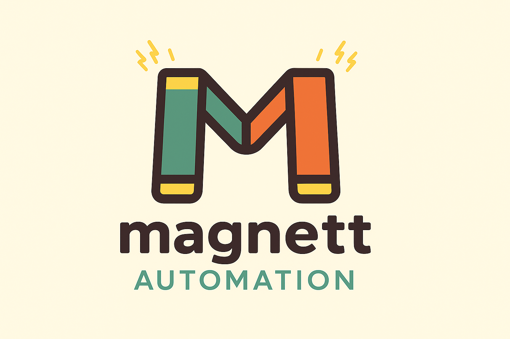

# Magnett Automation Core


[](https://github.com/LHPiney/magnett-automation-core/actions/workflows/build-and-analyze.yml)
[](https://dev.azure.com/Magnett/Magnett.Automation/_build/latest?definitionId=1&branchName=azure-pipelines)
[](https://sonarcloud.io/dashboard?id=magnett_automation) [](https://sonarcloud.io/dashboard?id=magnett_automation)




## Overview

Magnett Automation Core is a powerful .NET library designed to simplify process automation and workflow orchestration. With a flexible and declarative structure, it offers advanced tools for building-customizable state machines and workflows with ease and scalability.

## Why Choose Magnett Automation Core?

- **Ease of Use** – Provides a simple and intuitive way to define state machines and workflows.
- **Scalability** – Supports complex workflows and business processes efficiently.
- **Modularity** – Designed with decoupled components, enabling reuse and extensibility.
- **Efficiency** – Reduces code complexity while improving readability and maintainability.

## Installation

To install the library via NuGet, use the following command:

```sh
 dotnet add package Magnett.Automation.Core
```

## Core Components

### 1. Context Management

The context system allows you to store and retrieve data in a structured, key-value manner.

```csharp
var context = Context.Create();
var field   = ContextField<int>.Create("FieldName");

//Set Value
context.Store(field, random.Next(1000));

//Get Value
var value  = context.Value(field); 
```

### 2. State Machine

State machines help manage process behavior by defining states and transitions between them.

#### Defining a State Machine

```csharp
//Helper class with states
public class State : Enumeration
{
    public static readonly State Init     = new State(1, nameof(Init));
    public static readonly State Working  = new State(2, nameof(Working));
    public static readonly State Paused   = new State(3, nameof(Paused));
    public static readonly State Finished = new State(4, nameof(Finished));

    private State(int id, string name) : base(id, name) { }
}

//Helper class with actions
public class Action : Enumeration
{
    public static readonly Action Start    = new Action(1, nameof(Start));
    public static readonly Action Pause    = new Action(2, nameof(Pause));
    public static readonly Action Continue = new Action(3, nameof(Continue));
    public static readonly Action Finish   = new Action(4, nameof(Finish));

    private Action(int id, string name) : base(id, name) {}
}

//Definition of the machine
var machineDefinition = MachineDefinitionBuilder.Create()
    .InitialState(State.Init)
        .OnAction(Action.Start).ToState(State.Working)
        .Build()
    .AddState(State.Working)
        .OnAction(Action.Pause).ToState(State.Paused)
        .OnAction(Action.Finish).ToState(State.Finished)
        .Build()
    .AddState(State.Paused)
        .OnAction(Action.Continue).ToState(State.Working)
        .Build()
    .AddState(State.Finished)
        .Build()

    .BuildDefinition();

//Create and use the machine
var machine = Machine.Create(machineDefinition);
machine.Dispatch(Action.Start);

var currentState = machine.State  //Working
```
See full example [SimpleMachine](https://github.com/LHPiney/magnett-automation-core/tree/main/test/Magnett.Automation.Core.IntegrationTest/StateMachines/SimpleMachine)

### 3. Workflow Automation

Workflows enable the automation of sequential or parallel tasks, ensuring processes are executed in the correct order.

#### Defining a Workflow

```csharp
//Create the flow definition
  var definition = FlowDefinitionBuilder.Create()
     .WithInitialNode<ResetValue>(NodeName.Reset)
        .OnExitCode(ResetValue.ExitCode.Ok).GoTo(NodeName.SetValue)
        .Build() 
     .WithNode<SetValue>(NodeName.SetValue)
        .OnExitCode(SetValue.ExitCode.Assigned).GoTo(NodeName.SumValue)
        .Build() 
     .WithNode<SumValue>(NodeName.SumValue)
        .Build()
     .BuildDefinition()

//Create the flow and Run
var context    = Context.Create();
var flowRunner = FlowRunner.Create(definition, context);
var flow       = Flow.Create();
var exit       = await flow.Run();
```

See full example [SimpleFlow](https://github.com/LHPiney/magnett-automation-core/tree/main/test/Magnett.Automation.Core.IntegrationTest/WorkFlows/SimpleFlow/Definitions)

## Acknowledgments & Feedback

We sincerely appreciate your interest in Magnett Automation Core! Your feedback is invaluable in helping us improve and refine the library. If you have suggestions, encounter issues, or would like to contribute, please open an issue or submit a pull request in our [GitHub repository](https://github.com/LHPiney/magnett-automation-core/issues).

Thank you for your support and for being part of this project!

## License

This project is licensed under the MIT License - see the [LICENSE](LICENSE) file for details.
```