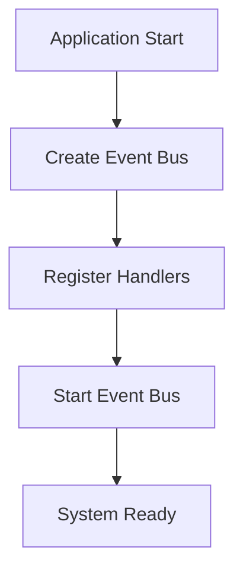
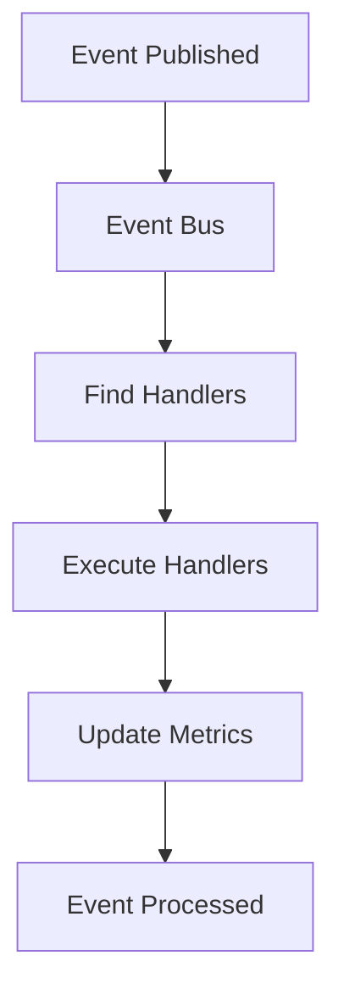
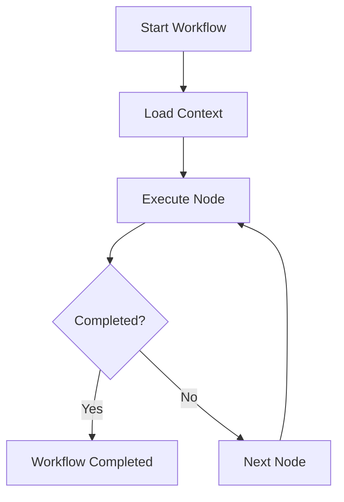

# System Architecture

Magnett Automation Core is designed with a modular and extensible architecture that allows building complex automation systems efficiently.

## Overview

The architecture is based on three main pillars:

1. **State Machines** - For handling complex state transitions
2. **Workflows** - For orchestrating business processes
3. **Events** - For asynchronous communication and decoupling

## Main Components

### Event Bus

The Event Bus is the core of the system, providing:

- **Event Publishing**: Allows publishing events asynchronously
- **Handler Registration**: Automatically discovers and registers event handlers
- **Metrics**: Collects performance and usage metrics
- **Monitoring**: Provides visibility into system state

```csharp
var eventBus = EventBus.Create(logger);
eventBus.EventHandlerRegistry.Register<MyEventHandler>();
eventBus.Start();
```

### State Machines

State machines provide:

- **Declarative Definition**: States and transitions defined clearly
- **Validation**: Automatic transition validation
- **Asynchronous Actions**: Support for long-running operations
- **Error Handling**: Error states and recovery

```csharp
var definition = MachineDefinitionBuilder.Create()
    .WithInitialState("Initial")
    .WithState("Initial")
        .OnAction("Next").GoTo("Next")
        .Build()
    .Build();
```

### Workflows

Workflows allow:

- **Processing Nodes**: Encapsulated business logic
- **Shared Context**: Data shared between nodes
- **Exit Codes**: Structured results
- **Cancellation**: Operation cancellation handling

```csharp
public class MyNode : NodeAsync
{
    protected override async Task<NodeExit> HandleAsync(Context context, CancellationToken cancellationToken = default)
    {
        // Processing logic
        return NodeExit.Completed(ExitCode.Done, "Completed");
    }
}
```

### Context Management

The context system provides:

- **Type-Safe Fields**: Type-safe fields with validation
- **Persistent Storage**: Automatic data persistence
- **Data Sharing**: Data shared between components
- **Validation**: Automatic type validation

```csharp
private readonly ContextField<string> _nameField = ContextField<string>.WithName("Name");
var name = context.Value(_nameField);
```

## Data Flow

### 1. System Startup



### 2. Event Processing



### 3. Workflow Execution



## Design Patterns

### Observer Pattern

The Event Bus implements the Observer pattern for decoupled communication:

```csharp
// Publisher
await eventBus.PublishAsync(new MyEvent("data"));

// Subscriber
public class MyHandler : IEventHandler<MyEvent>
{
    public Task Handle(MyEvent @event, ILogger logger, CancellationToken cancellationToken)
    {
        // Handle event
        return Task.CompletedTask;
    }
}
```

### State Pattern

State machines implement the State pattern for handling transitions:

```csharp
var machine = Machine.Create(definition, eventBus);
await machine.DispatchAsync("Action"); // Changes state
```

### Command Pattern

Workflows implement the Command pattern for encapsulating operations:

```csharp
public class ProcessOrderCommand : NodeAsync
{
    protected override async Task<NodeExit> HandleAsync(Context context, CancellationToken cancellationToken = default)
    {
        // Execute command
        return NodeExit.Completed(ExitCode.Done, "Command executed");
    }
}
```

## Extensibility

### Custom Handlers

You can create custom handlers for specific events:

```csharp
public class CustomHandler : IEventHandler<MyCustomEvent>
{
    public Task Handle(MyCustomEvent @event, ILogger logger, CancellationToken cancellationToken)
    {
        // Custom logic
        return Task.CompletedTask;
    }
}
```

### Custom Nodes

You can create custom nodes for specific workflows:

```csharp
public class CustomNode : NodeAsync
{
    protected override async Task<NodeExit> HandleAsync(Context context, CancellationToken cancellationToken = default)
    {
        // Custom logic
        return NodeExit.Completed(ExitCode.Done, "Custom node completed");
    }
}
```

### Custom Metrics

You can implement custom metrics:

```csharp
public class CustomMetrics : IMetricsCollector
{
    public void IncrementCounter(string name, int value = 1)
    {
        // Implement custom counter
    }
    
    public void RecordDuration(string name, TimeSpan duration)
    {
        // Implement custom duration
    }
}
```

## Performance Considerations

### Asynchronous Operations

- Use `async/await` for I/O operations
- Avoid blocking operations
- Implement appropriate timeouts

### Memory Management

- Release resources appropriately
- Use `using` statements
- Implement `IDisposable` when necessary

### Concurrency

- Use `CancellationToken` for cancellation
- Implement concurrency limits
- Handle exceptions appropriately

## Security

### Input Validation

- Validate all input data
- Use type-safe fields when possible
- Implement data sanitization

### Error Handling

- Implement robust error handling
- Appropriate error logging
- Automatic recovery when possible

### Auditing

- Log all important operations
- Maintain audit trails
- Implement security monitoring
